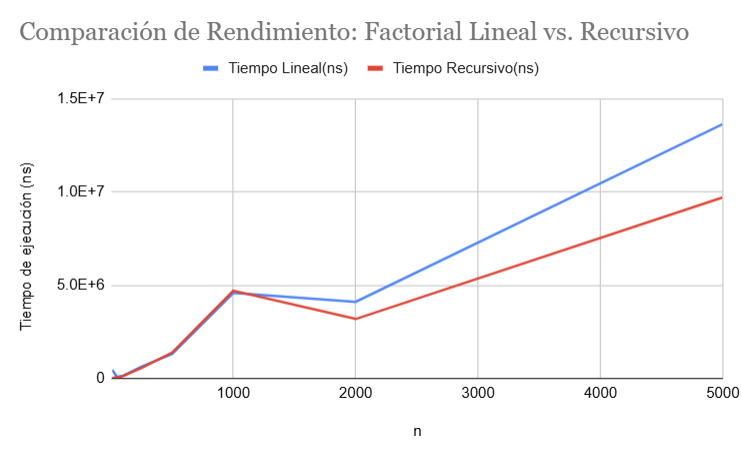

# Tarea 1: Análisis de Rendimiento - Factorial Lineal vs. Recursivo

**Estudiante:** Benjamín López
**Profesor:** Ricardo Gacitua
**Curso:** Programación Avanzada - ICC708

---

## 1. Descripción
Implementación y análisis de rendimiento de la función matemática **Factorial**, programada utilizando dos enfoques distintos en Java:
1. **Enfoque Lineal**
2. **Enfoque Recursivo**

---

Para evitar el desbordamiento de memoria (overflow) causado por el rápido crecimiento exponencial de los factoriales, se utilizó la clase `BigInteger` nativa de Java, la cual permite calcular factoriales de números muy grandes (como $n=5000$) sin perder precisión.

---

## 2. Ejecución y Medición de Tiempos
El algoritmo fue sometido a prueba para diferentes tamaños de entrada ($n$):
`10, 50, 100, 250, 500, 1000, 2000, 5000`

Los tiempos de ejecución fueron medidos utilizando `System.nanoTime()` para obtener la mayor precisión posible, registrando los resultados en **nanosegundos (ns)**.

---

## 3. Resultados

| n | Tiempo Lineal (ns) | Tiempo Recursivo (ns) |
|---|---|---|
| 10 | 465500 | 14100 |
| 50 | 67600 | 56800 |
| 100 | 138500 | 130200 |
| 250 | 633100 | 559800 |
| 500 | 1306700 | 1383700 |
| 1000 | 4586500 | 4706000 |
| 2000 | 4108600 | 3185900 |
| 5000 | 13644700 | 9706800 |

---

## 4. Gráfico de Resultados

---

## 5. Análisis y Conclusiones

Al observar los resultados iniciales (como en $n=10$), el método lineal aparenta ser considerablemente más lento. En realidad, esto es un espejismo técnico: el entorno de Java necesita un instante de "calentamiento" para cargar sus componentes internos antes de alcanzar su velocidad óptima. El primer algoritmo en ejecutarse siempre absorbe esta demora inicial, lo que distorsiona la comparación en esos primeros valores.

A medida que avanzamos hacia números enormes como $n=5000$, los tiempos de ambas versiones crecen de forma constante, manteniéndose el método lineal siempre por encima del recursivo. Aunque la teoría tradicional sugiere que la recursividad debería ser más pesada, en la realidad, al realizar multiplicaciones tan gigantes, el cálculo matemático puro absorbe todo el esfuerzo del computador. Esto demuestra que, en esta ejecución en particular, el sistema interno logró optimizar y procesar las llamadas de la versión recursiva de una manera ligeramente más fluida.